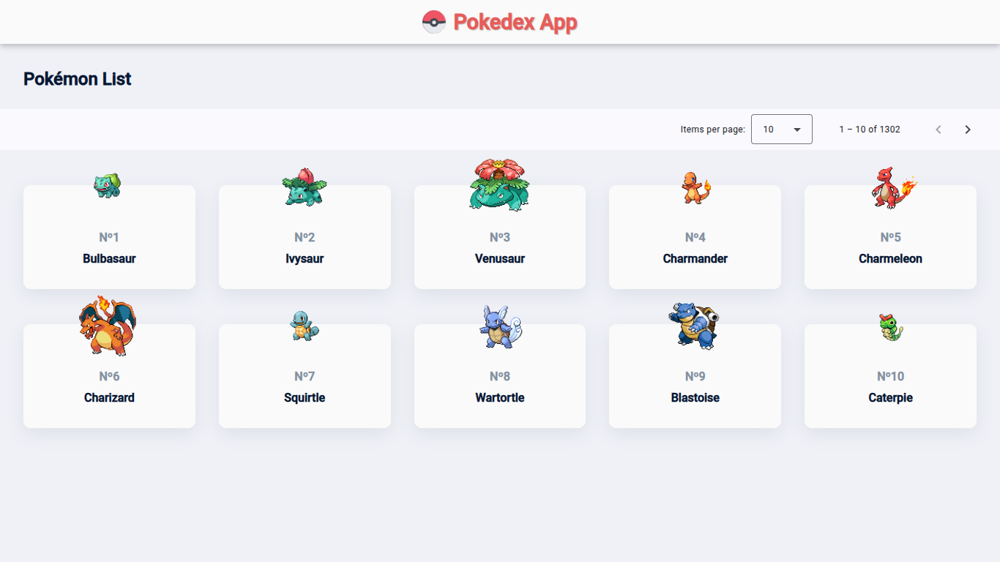
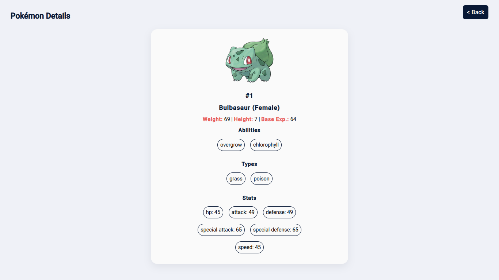

# 📱 Pokedex App

A mobile-friendly web application built with **Ionic + Angular** that allows users to browse and explore data from the [PokéAPI](https://pokeapi.co).

> 🧪 **This project was created out of curiosity and for learning purposes** — it's my **first experience using the Angular framework**. It helped me understand core concepts such as routing, components, services, and integration with third-party APIs.

## ✨ Features

- 🔍 **Paginated Pokémon list**
  - Navigate through Pokémon pages
  - Choose how many Pokémon to display per page

- 📋 **Pokémon details view**
  - Displays stats, types, abilities, height, weight, and images
  - Includes a **"Go Back"** button for smooth navigation
  - Shows a **loading spinner** while data is being fetched

- 💅 Built with **Ionic Framework** and styled using **Angular components**


## 🖼️ Screenshots

Some screenshots from the app:

<p align="center">
  
  <br>Pokémon list page with pagination
</p>

<p align="center">
  
  <br>Pokémon details
</p>

## 🚀 Getting Started

### Prerequisites

- Node.js >= 18
- Ionic CLI
- Angular CLI

### Installation

```bash
# Clone the repository
git clone https://github.com/MarcosAntonio15243/pokedex-app.git

# Navigate to the project folder
cd pokedex-app

# Install dependencies
npm install

# Run the app locally
ionic serve
```

## 📁 Project Structure

```
src/
├── app/
│   ├── components
│   │   └── pokemon-card/   → Pokémon card component
│   ├── home/               → Pokémon list page
│   ├── details/            → Pokémon details page
│   └── services/           → Pokémon API service
├── assets/                 → Static assets like images and icons
└── environments/           → Environment-specific configuration files
```

## 🔗 API Reference

This project consumes data from:

- [PokéAPI](https://pokeapi.co)

## 🙋‍♂️ Author

Made with  [Marcos Antonio](https://github.com/MarcosAntonio15243).

- 💻 Full Stack developer dedicated to building complete solutions by combining modern, functional user interfaces with robust back-end architectures.
- 📚 This project represents my first experience using **Angular** and **Ionic**, created purely for exploration and skill development.
- 🚀 Always open to feedback, collaboration, or ideas for improvement!
- 📫 Feel free to connect with me on [LinkedIn](https://www.linkedin.com/in/marcos-antonio-18059b234) or check out more of my projects here on GitHub.